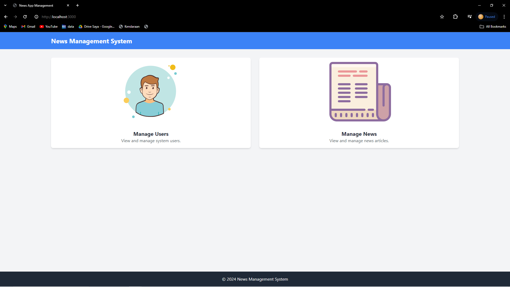

# News App Management - Backend Developer Bootcamp Project

## Deskripsi


Project ini merupakan bagian dari Final Project Backend Developer Bootcamp yang diselenggarakan oleh KelasWork. Dalam proyek ini, kami mengimplementasikan pengetahuan dan keterampilan yang diperoleh selama bootcamp.

Aplikasi ini adalah News App Management yang memungkinkan pengguna untuk mengelola pengguna (users) dan berita (news). Kami menggunakan arsitektur MVC (Model-View-Controller) berbasis Promise dalam pengembangan aplikasi ini. Teknologi utama yang kami gunakan meliputi Postgres sebagai basis data, Sequelize sebagai ORM (Object-Relational Mapping) untuk berinteraksi dengan basis data, Express.js sebagai framework backend, dan Ejs sebagai mesin template untuk rendering tampilan.

## Fitur

- **Manage Users**: Pengguna dapat membuat, mengedit, dan menghapus akun pengguna. Validasi data telah diterapkan untuk memastikan integritas data yang lebih baik, termasuk validasi untuk nama pengguna, kata sandi, email, dan nomor telepon.
- **Manage News**: Pengguna dapat membuat, mengedit, dan menghapus berita. Validasi juga telah diterapkan pada judul, slug, dan konten berita untuk memastikan data yang dimasukkan tidak boleh kosong dan harus unik.

## Teknologi yang Digunakan

- **Postgres**: Basis data relasional yang digunakan untuk menyimpan informasi pengguna dan berita.
- **Sequelize**: ORM (Object-Relational Mapping) untuk berinteraksi dengan basis data Postgres.
- **Express.js**: Framework backend JavaScript yang digunakan untuk mengelola rute dan logika bisnis aplikasi.
- **Ejs**: Mesin template untuk merender tampilan aplikasi.

## Cara Menggunakan

1. Pastikan Anda telah menginstal Node.js dan Postgres di sistem Anda.
2. Clone repository ini ke dalam sistem lokal Anda.
3. Sesuaikan environment database pada file `/config/config.json`.
4. Jalankan `npm install` untuk menginstal semua dependensi proyek.
5. Jalankan migrasi basis data dengan menjalankan perintah
   ```bash
   npx sequelize-cli db:create
   npx sequelize-cli db:migrate
   npx sequelize-cli db:seed:all
   ```
6. Mulai aplikasi dengan menjalankan `node index.js`.
7. Akses aplikasi melalui browser di `http://localhost:3000`.
